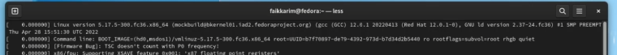
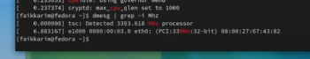
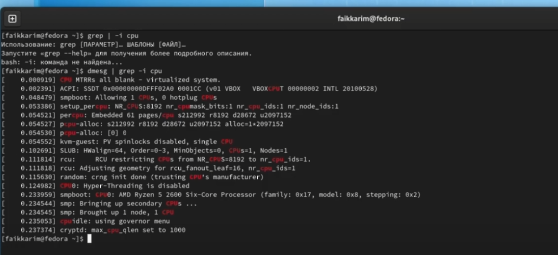
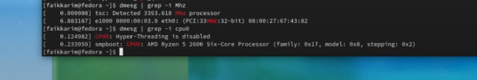
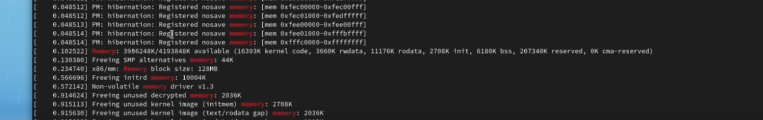
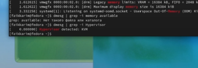
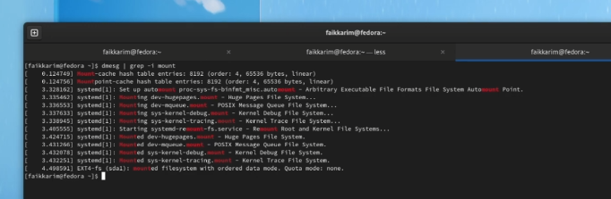

---
## Front matter
title: "лабораторная работа no. 2"
subtitle: "Управление версиями"
author: "Фаик Карим"

## Generic otions
lang: ru-RU
toc-title: "Содержание"

## Bibliography
bibliography: bib/cite.bib
csl: pandoc/csl/gost-r-7-0-5-2008-numeric.csl

## Pdf output format
toc: true # Table of contents
toc-depth: 2
lof: true # List of figures
lot: true # List of tables
fontsize: 12pt
linestretch: 1.5
papersize: a4
documentclass: scrreprt
## I18n polyglossia
polyglossia-lang:
  name: russian
  options:
	- spelling=modern
	- babelshorthands=true
polyglossia-otherlangs:
  name: english
## I18n babel
babel-lang: russian
babel-otherlangs: english
## Fonts
mainfont: PT Serif
romanfont: PT Serif
sansfont: PT Sans
monofont: PT Mono
mainfontoptions: Ligatures=TeX
romanfontoptions: Ligatures=TeX
sansfontoptions: Ligatures=TeX,Scale=MatchLowercase
monofontoptions: Scale=MatchLowercase,Scale=0.9
## Biblatex
biblatex: true
biblio-style: "gost-numeric"
biblatexoptions:
  - parentracker=true
  - backend=biber
  - hyperref=auto
  - language=auto
  - autolang=other*
  - citestyle=gost-numeric
## Pandoc-crossref LaTeX customization
figureTitle: "Рис."
tableTitle: "Таблица"
listingTitle: "Листинг"
lofTitle: "Список иллюстраций"
lotTitle: "Список таблиц"
lolTitle: "Листинги"
## Misc options
indent: true
header-includes:
  - \usepackage{indentfirst}
  - \usepackage{float} # keep figures where there are in the text
  - \floatplacement{figure}{H} # keep figures where there are in the text
---

# Цель работы

Целью данной работы является приобретение практических навыков установки операционной системы на виртуальную машину, настройки минимально необходимых для
дальнейшей работы сервисов.

# Ход работы

1. Версия ядра Linux (Linux version).

*изображение 1*

2. Частота процессора (Detected Mhz processor): 

*изображение 2*

3. Модель процессора (CPU0).

*изображение 3*

*изображение 3.1*

4. Объем доступной оперативной памяти (Memory available).

*изображение 5*

5.Тип обнаруженного гипервизора (Hypervisor detected).

*изображение 6*

6. Тип файловой системы корневого раздела.

*изображение 7*

7. Последовательность монтирования файловых систем.

# Вывод

Было  приобретение практических навыков установки операционной системы на виртуальную машину, настройки минимально необходимых для
дальнейшей работы сервисов.

