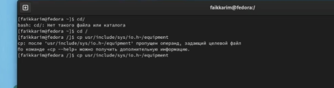
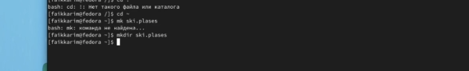
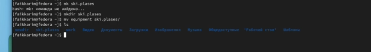
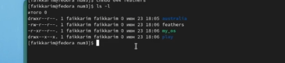
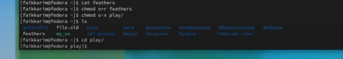
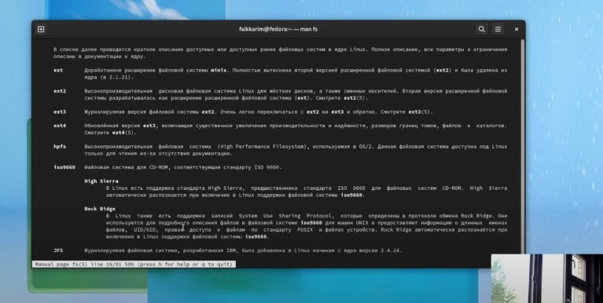

---
## Front matter
title: "лабораторная работа 5"
subtitle: Анализ файловой системы Linux
author: "Фаик Карим"

## Generic otions
lang: ru-RU
toc-title: "Содержание"

## Bibliography
bibliography: bib/cite.bib
csl: pandoc/csl/gost-r-7-0-5-2008-numeric.csl

## Pdf output format
toc: true # Table of contents
toc-depth: 2
lof: true # List of figures
lot: true # List of tables
fontsize: 12pt
linestretch: 1.5
papersize: a4
documentclass: scrreprt
## I18n polyglossia
polyglossia-lang:
  name: russian
  options:
	- spelling=modern
	- babelshorthands=true
polyglossia-otherlangs:
  name: english
## I18n babel
babel-lang: russian
babel-otherlangs: english
## Fonts
mainfont: PT Serif
romanfont: PT Serif
sansfont: PT Sans
monofont: PT Mono
mainfontoptions: Ligatures=TeX
romanfontoptions: Ligatures=TeX
sansfontoptions: Ligatures=TeX,Scale=MatchLowercase
monofontoptions: Scale=MatchLowercase,Scale=0.9
## Biblatex
biblatex: true
biblio-style: "gost-numeric"
biblatexoptions:
  - parentracker=true
  - backend=biber
  - hyperref=auto
  - language=auto
  - autolang=other*
  - citestyle=gost-numeric
## Pandoc-crossref LaTeX customization
figureTitle: "Рис."
tableTitle: "Таблица"
listingTitle: "Листинг"
lofTitle: "Список иллюстраций"
lotTitle: "Список таблиц"
lolTitle: "Листинги"
## Misc options
indent: true
header-includes:
  - \usepackage{indentfirst}
  - \usepackage{float} # keep figures where there are in the text
  - \floatplacement{figure}{H} # keep figures where there are in the text
---

# Цель работы

Ознакомление с файловой системой Linux, её структурой, именами и содержанием
каталогов. Приобретение практических навыков по применению команд для работы
с файлами и каталогами, по управлению процессами (и работами), по проверке использования диска и обслуживанию файловой системы.

# Ход работы

1. Выполните все примеры, приведённые в первой части описания лабораторной работы.

2. Выполните следующие действия:

  2.1. Скопируйте файл /usr/include/sys/io.h в домашний каталог и назовите его
  equipment. Если файла io.h нет, то используйте любой другой файл в каталоге
  /usr/include/sys/ вместо него.  

  

  2.2.В домашнем каталоге создайте директорию ~/ski.plases

  

  2.3. Создайте и переместите каталог ~/newdir в каталог ~/ski.plases и назовите
  его plans.

  
  

3. Выполните следующие действия:
  3.1. drwxr--r-- ... australia
  3.2. drwx--x--x ... play
  3.3. -r-xr--r-- ... my_os
  3.4. -rw-rw-r-- ... feathers

  

4. Что произойдёт, если вы попытаетесь просмотреть файл ~/feathers командой
cat?

5. Прочитайте man по командам mount, fsck, mkfs, kill и кратко их охарактеризуйте,
приведя примеры.

# Вывод

Было изучина и ознакомление с файловой системой Linux, её структурой, именами и содержанием
каталогов. Приобретение практических навыков по применению команд для работы
с файлами и каталогами, по управлению процессами (и работами), по проверке использования диска и обслуживанию файловой системы.

